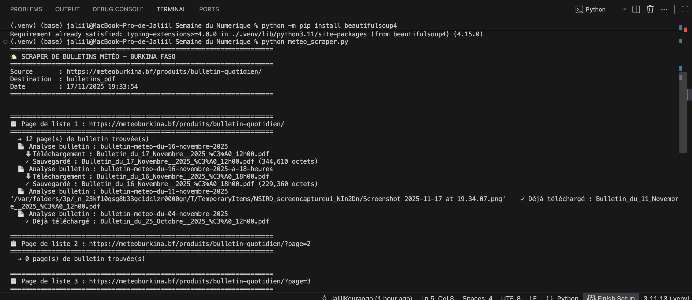
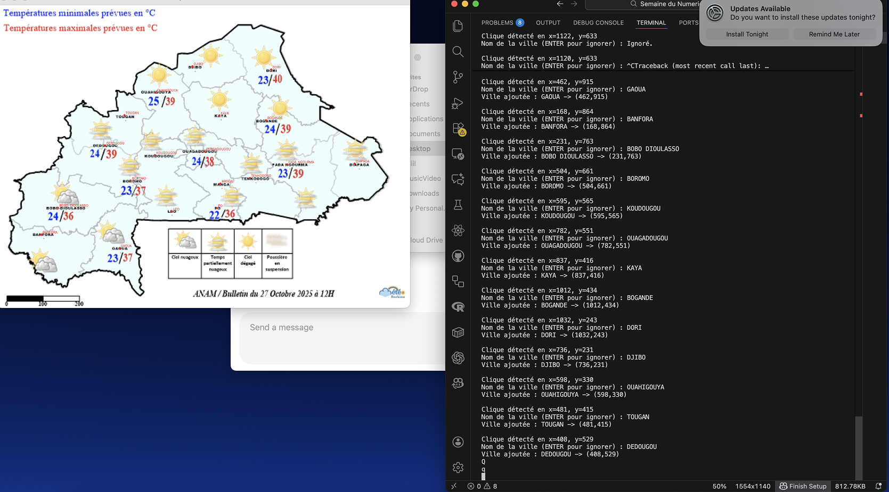
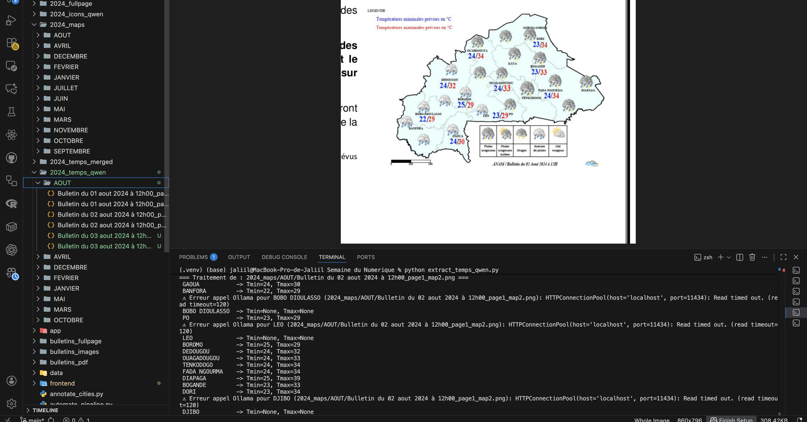
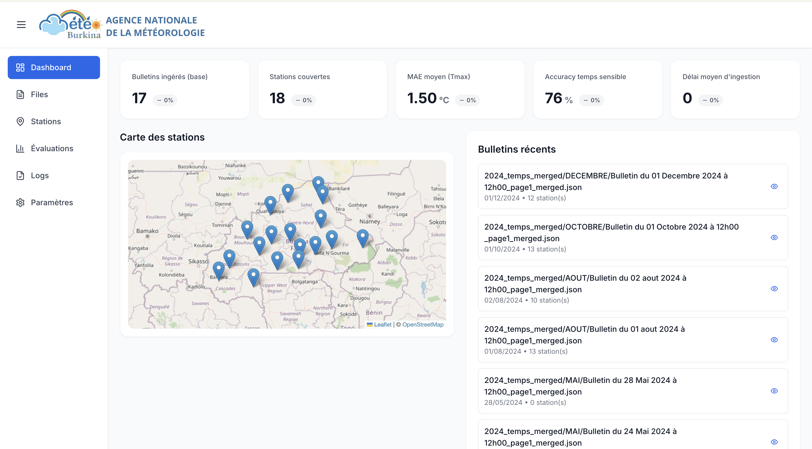
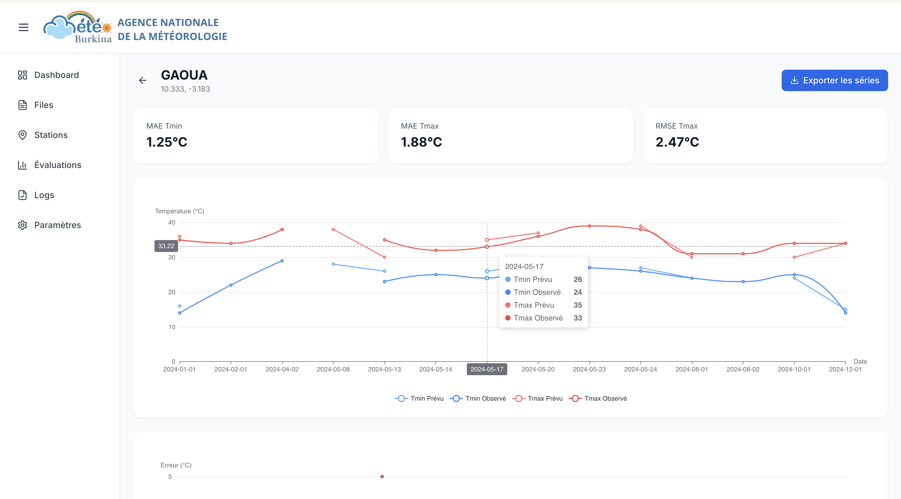
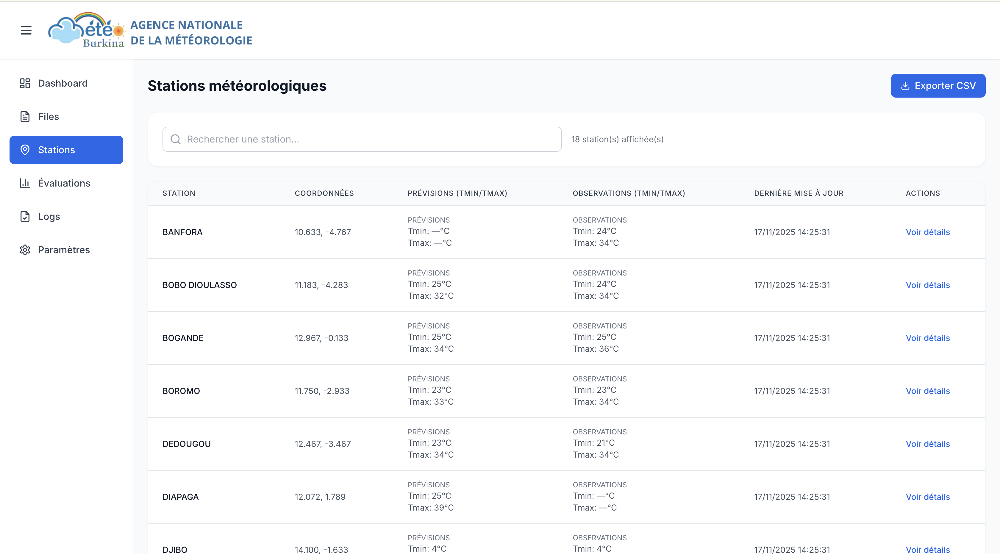

# Pipeline météo – Semaine du Numérique

> Collecter, transformer et exposer les bulletins météo de la Direction Générale de la Météorologie (Burkina Faso).

---

## 1. Architecture générale



| Bloc                  | Description                                                                                                      |
|----------------------|------------------------------------------------------------------------------------------------------------------|
| `meteo_scraper.py`   | Explore les pages `https://meteoburkina.bf/produits/bulletin-quotidien/`, détecte les liens PDF valides, télécharge dans `bulletins_pdf/`. |
| `pdf_to_images_recursive.py` | Convertit l’intégralité des PDF (`2024/<MOIS>/...pdf`) en PNG haute résolution (`2024_fullpage/`).                             |
| `crop_maps_recursive.py`     | Découpe automatiquement les cartes observées/prévues dans chaque page et range le résultat dans `2024_maps/<MOIS>/`.             |
| `extract_temps_qwen.py`      | Lisent les cartes (via Qwen3-VL + Ollama) pour extraire Tmin/Tmax/icônes sur toutes les villes référencées dans `cities_rel.json`. |
| `merge_maps.py`      | Fusionne `*_map1_observed.json` et `*_map2_forecast.json` en un fichier unique `*_merged.json` en ajoutant lat/lon. |
| `merge_all_merged.py`| Agrège tous les `*_merged.json` en `data/all_merged.json` (copie également sous `2024_temps_merged/all_merged.json`). |
| `evaluate_forecasts.py` | Calcule MAE/RMSE et accuracy macro-F1 puis écrit `data/evaluation_metrics.json`.                                     |
| FastAPI (`app/`)     | API REST + base SQLite (`data/meteo.db`) : import des bulletins, CRUD stations, export de `all_merged.json`, statistiques, déclenchement du pipeline (`/scraping/start`). |
| Frontend React (`frontend/frontend`) | Dashboard (Cartes + KPIs), Files (aperçu des bulletins), Stations (Tmin/Tmax), Évaluation, Logs, Paramètres.  |

---

## 2. Mise en route rapide

### Prérequis

- Python ≥ 3.10 (virtualenv recommandé)
- Node.js ≥ 18 (pour le dashboard)
- Dépendances système : `tesseract-ocr`, `libgl1`, `libglib2.0-0`, `poppler-utils`
- (Optionnel) Ollama + modèle `qwen3-vl:8b` si vous utilisez `extract_temps_qwen.py`

### Installation backend

```bash
python -m venv .venv
source .venv/bin/activate
pip install --upgrade pip
pip install -r requirements.txt  # si disponible, sinon installez les libs listées dans les scripts
```

### Installation frontend

```bash
cd frontend/frontend
npm install
```

### Lancer l’API

```bash
uvicorn app.main:app --reload
```

Au démarrage, l’API :
1. crée `data/meteo.db` si nécessaire ;
2. importe automatiquement les données de `data/all_merged.json` (seed) si aucune entrée n’est présente ;
3. expose les routes (bulletins, stations, stats, exports, scraping, etc.).

### Lancer le dashboard

```bash
cd frontend/frontend
REACT_APP_API_URL=http://localhost:8000 npm start
```

Les pages se rafraîchissent automatiquement en interrogeant l’API FastAPI.

---

## 3. Pipeline détaillé

> Tout ce qui suit peut être orchestré via `python automate_pipeline.py --api-url http://127.0.0.1:8000`.

### Étape 1 – Scraping

1. `python meteo_scraper.py`
   - Parcourt les pages listées (`?page=1,2...`).
   - Vérifie chaque lien avec une expression régulière stricte.
   - Télécharge les PDF non présents dans `bulletins_pdf/`.

### Étape 2 – Conversion PDF → images

```bash
python pdf_to_images_recursive.py
```

- Convertit tous les PDF trouvés dans `2024/` vers `2024_fullpage/<MOIS>/...png`.
- DPI configurable dans le script (`dpi=200` par défaut).

### Étape 3 – Découpe des cartes & géoréférencement

- Avant de lancer les extractions, utilisez `annotate_cities.py` pour cliquer chaque ville sur la carte de référence (`base_map_cities.png`). Le script produit `cities_positions.json`, base des coordonnées relatives.



```bash
python crop_maps_recursive.py
```

- Utilise les coordonnées relatives (`MAP1_X0`, etc.) pour extraire automatiquement `map1` (observé) et `map2` (prévision).
- Résultat sous `2024_maps/<MOIS>/..._map{1,2}.png`.

### Étape 4 – Extraction des températures/icônes



Deux options :

1. **OCR Tesseract (`extract_temps_relative.py`)**
   - Crops autour des coordonnées (`cities_rel.json`) et utilise pytesseract.
   - Produit `2024_temps_json_rel/<MOIS>/..._observed.json`.

2. **LLM (`extract_temps_qwen.py`)**
   - Envoie les crops à Qwen3-VL (Ollama) pour lire Tmin/Tmax + icônes.
   - Écrit `2024_temps_qwen/<MOIS>/..._map1_observed.json` & `..._map2_forecast.json`.

### Étape 5 – Fusion

```bash
python merge_maps.py
```

- Fusionne observed/prévision en `2024_temps_merged/<MOIS>/..._merged.json`.
- Chaque entrée contient :
  ```json
  {
    "nom": "BANFORA",
    "latitude": 10.6333,
    "longitude": -4.7667,
    "Tmin_obs": 24,
    "Tmax_obs": 31,
    "temps_obs": "nuageux",
    "Tmin_prev": 23,
    "Tmax_prev": 29,
    "temps_prev": "pluie",
    "interpretation_moore": "",
    "interpretation_dioula": ""
  }
  ```

### Étape 6 – Agrégation & métriques

```bash
python merge_all_merged.py          # crée 2024_temps_merged/all_merged.json et data/all_merged.json
python evaluate_forecasts.py        # lit data/all_merged.json, écrit data/evaluation_metrics.json
```

`evaluate_forecasts` calcule MAE/RMSE pour Tmin/Tmax et accuracy/F1 macro pour les icônes.

---

## 4. API FastAPI

| Endpoint                         | Description                                                                                                    |
|---------------------------------|----------------------------------------------------------------------------------------------------------------|
| `GET /health`                   | Ping simple.                                                                                                   |
| `GET /stats/overview`           | Nombre de bulletins/stations/reports + dernier bulletin.                                                       |
| `GET /bulletins`                | Liste paginée des bulletins (`start_date`, `end_date`, `limit`, `offset`).                                     |
| `GET /bulletins/{id}`           | Détail d’un bulletin (stations, Tmin/Tmax).                                                                    |
| `POST /bulletins/import`        | Import d’un JSON `*_merged.json` (supporte `replace_existing`).                                                |
| `DELETE /bulletins/{id}`        | Supprime un bulletin (cascade sur les `station_reports`).                                                      |
| `GET /stations`                 | Annuaire des stations + dernier `Tmin/Tmax` observé/prévu.                                                      |
| `GET /stations/{id}`            | Détail d’une station (metadata + dernier relevé).                                                              |
| `GET /stations/{id}/reports`    | Historique des reports pour la station.                                                                        |
| `GET /exports/all-merged`       | Renvoie `data/all_merged.json`.                                                                                |
| `GET /exports/merged-file?path=`| Renvoie le contenu JSON du fichier `2024_temps_merged/<...>_merged.json` demandé.                              |
| `GET /evaluation/metrics`       | Lit `data/evaluation_metrics.json`.                                                                            |
| `POST /scraping/start`          | Déclenche `meteo_scraper.py` puis `automate_pipeline.py --api-url ...` en tâche de fond (logs console).        |

> La base SQLite (via SQLAlchemy) stocke : `stations`, `bulletins`, `station_reports`. Les schémas Pydantic (`app/schemas.py`) exposent `Tmin/Tmax` observés/prévus directement dans les réponses.

---

## 5. Dashboard React





### Pages principales

1. **Dashboard**
   - KPIs (bulletins, stations, MAE, accuracy).
   - Carte Leaflet des stations (clic ⇒ détails).
   - Timeline des bulletins récents.
   - Bloc informatif rappelant la commande `automate_pipeline.py`.

2. **Files**
   - Table (date, stations, chemin source).
   - Bouton “Voir” ⇢ ouvre une modale avec toutes les stations du bulletin (observations/prévisions) + metadata.

3. **Stations**
   - Liste filtrable, affiche `Tmin/Tmax` observés & prévus.
   - Accès détaillé (`/station/:id`) avec courbes temps, matrice de confusion, export CSV.

4. **Évaluation**
   - KPIs globaux (MAE/RMSE, accuracy, F1 macro).
   - Carte heatmap, tendance MAE, matrice de confusion agrégée.

5. **Logs**
   - Liste des imports (via `/bulletins`), avec statut et mini-log.

6. **Paramètres**
   - Langue par défaut (Français) pour la génération de bulletins.
   - Sélection du modèle LLM (`qwen3-vl:8b` par défaut).

### Build / Déploiement

```bash
cd frontend/frontend
npm run build
```

- Génère `frontend/frontend/build`. Servir via `serve -s build` ou derrière un reverse-proxy.
- Vérifiez que `REACT_APP_API_URL` est défini dans `.env` ou via la commande.

---

## 6. Scraping automatisé

- Endpoint `POST /scraping/start` : lance `meteo_scraper.py` puis `automate_pipeline.py`. Les journaux apparaissent dans la console FastAPI.
- Pour un contrôle total, lancer manuellement sur le serveur :
  ```bash
  python meteo_scraper.py
  python automate_pipeline.py --api-url http://127.0.0.1:8000
  ```
- `automate_pipeline.py` :
  1. Exécute les scripts de la pipeline (sauf ceux passés avec `--skip-*`).
  2. Importe automatiquement chaque `*_merged.json` (avec `replace_existing` si `--force-reimport`).
  3. Journalise les fichiers importés dans `data/imported_files.log` (évite les doublons).

---

## 7. Nettoyage & agrégation

- `clean_merged_reports.py` : supprime les stations entièrement vides (`Tmin/Tmax` null des deux côtés).
- `merge_all_merged.py` : produit `all_merged.json` (2024 + data/) avec `bulletin_count`, `generated_at`, `bulletins`.
- `evaluate_forecasts.py --output data/evaluation_metrics.json` : résume les performances.

---

## 8. Données structurées

- `cities_positions.json` : coordonnées cliquées à la main (x,y absolus).
- `cities_rel.json` : coordonnées relatives (0-1) utilisées par les extracteurs.
- `cities_rel_with_coords.json` : version enrichie (lat/lon) pour la fusion.
- `2024_temps_qwen/` : JSON bruts par carte.
- `2024_temps_merged/` : JSON fusionnés par bulletin.
- `data/all_merged.json` : agrégation complète (importée dans SQLite).
- `data/evaluation_metrics.json` : métriques globales pour la page Évaluation.

---

## 9. FAQ / Tips

- **Je veux réinitialiser la base** : supprimez `data/meteo.db` puis relancez `uvicorn` (le seed se refera depuis `data/all_merged.json`).
- **Je veux re-scraper depuis zéro** : supprimez `bulletins_pdf/` et `2024/`, puis relancez `meteo_scraper.py` + `automate_pipeline.py`.
- **Je veux comparer OCR vs LLM** : conservez `2024_temps_json_rel/` et `2024_temps_qwen/`, puis ajustez `merge_maps.py` pour fusionner l’une ou l’autre source.
- **Déploiement** :
  - API: `uvicorn app.main:app --host 0.0.0.0 --port 8000` derrière Nginx ou autre.
  - Front: `npm run build` puis `serve -s build` ou intégration dans un S3/CloudFront.
  - Assurez-vous que `REACT_APP_API_URL` pointe vers l’URL publique de l’API.

---

## 10. Licence & crédits

- **Code Python** : MIT License (voir ci-dessous).
- **Libs principales** : `requests` (Apache 2.0), `beautifulsoup4` (MIT), `PyMuPDF` (AGPL v3), `Pillow` (PIL License), `opencv-python` (MIT), `numpy` (BSD), `pytesseract` (Apache 2.0), `FastAPI`/`Uvicorn` (MIT), `React` (MIT).
- **Données** : bulletins officiels `meteoburkina.bf`. Vérifiez les droits de réutilisation avant diffusion.

---

Bon traitement des données météo ! 🌍🌤️

---

## MIT License

```
Copyright (c) 2024 [Votre nom]

Permission is hereby granted, free of charge, to any person obtaining a copy
of this software and associated documentation files (the "Software"), to deal
in the Software without restriction, including without limitation the rights
to use, copy, modify, merge, publish, distribute, sublicense, and/or sell
copies of the Software, and to permit persons to whom the Software is
furnished to do so, subject to the following conditions:

The above copyright notice and this permission notice shall be included in all
copies or substantial portions of the Software.

THE SOFTWARE IS PROVIDED "AS IS", WITHOUT WARRANTY OF ANY KIND, EXPRESS OR
IMPLIED, INCLUDING BUT NOT LIMITED TO THE WARRANTIES OF MERCHANTABILITY,
FITNESS FOR A PARTICULAR PURPOSE AND NONINFRINGEMENT. IN NO EVENT SHALL THE
AUTHORS OR COPYRIGHT HOLDERS BE LIABLE FOR ANY CLAIM, DAMAGES OR OTHER
LIABILITY, WHETHER IN AN ACTION OF CONTRACT, TORT OR OTHERWISE, ARISING FROM,
OUT OF OR IN CONNECTION WITH THE SOFTWARE OR THE USE OR OTHER DEALINGS IN THE
SOFTWARE.
```
